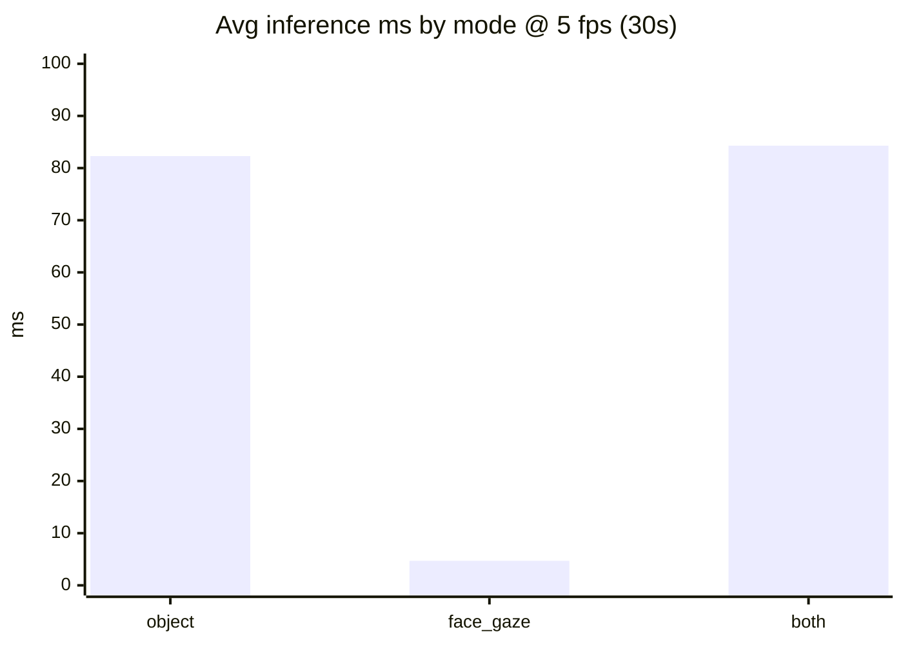
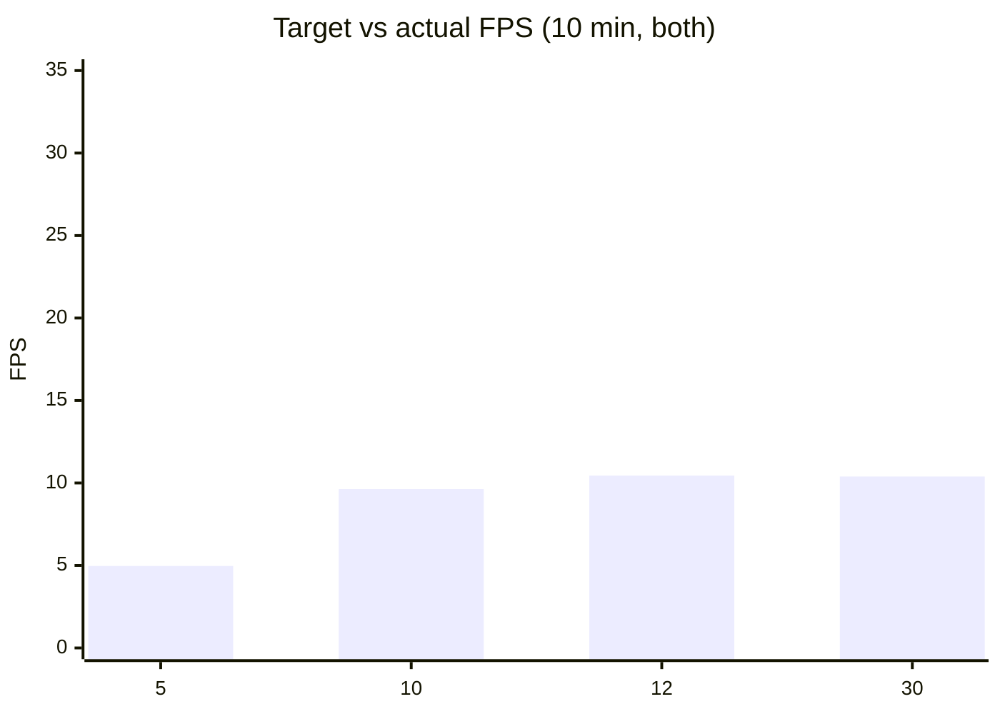
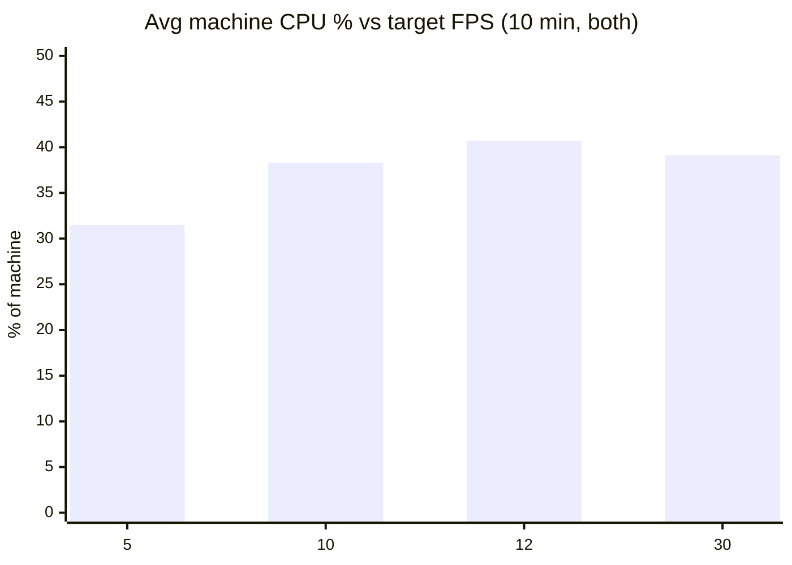

# CPU / RAM profiling

Issue [#15](https://github.com/MarcoMll/safe-exam/issues/15). Measures whether the unified frame processor can run as a background exam process without monopolizing the machine.

## What we measure

Samples apply to **this Python process only** (YOLO / MediaPipe / both). Other apps are not included in process CPU or RAM.

| Metric | Meaning |
|--------|---------|
| `avg_process_cpu_percent` | This process. **100% ≈ one core fully busy.** Can exceed 100% with multiple threads. |
| `avg_machine_cpu_percent` | `process_cpu / logical_cpu_count` — approximate **share of the whole CPU**. Compare to the issue’s **&lt;30%** target. |
| `avg_system_cpu_percent` | Entire machine (all apps). Context only. |
| `avg_ram_mb` / `peak_ram_mb` | Resident memory of this process. |
| `avg_fps` vs `target_fps` | If actual FPS ≪ target, the machine cannot keep up (CPU-bound). |

## Modes

| Mode | What runs |
|------|-----------|
| `object` | YOLO only |
| `face_gaze` | MediaPipe face gaze only |
| `both` | Full `process_frame()` (YOLO + MediaPipe) — production-like |
| `all` | `object` → `face_gaze` → `both` (cost drill-down) |

## How to run

Tooling: [`scripts/experiments/cpu_profile/`](../../../scripts/experiments/cpu_profile/)

```bash
cd scripts

# Cost drill-down (~30s per mode)
python -m experiments.cpu_profile --experiment experiment_1_desktop_pc --mode all --target-fps 5 --duration 30

# Sustained ladder (10 min each, appends to the same CSV)
python -m experiments.cpu_profile --experiment experiment_1_desktop_pc --mode both --target-fps 5 --duration 600
python -m experiments.cpu_profile --experiment experiment_1_desktop_pc --mode both --target-fps 10 --duration 600
```

| Flag | Default | Description |
|------|---------|-------------|
| `--experiment` | `experiment_1` | Results folder name |
| `--mode` | `both` | `object` / `face_gaze` / `both` / `all` |
| `--target-fps` | `5` | Capture target FPS |
| `--duration` | `600` | Seconds **after** warmup |
| `--warmup` | `15` | Seconds discarded before measuring |
| `--camera-index` | `0` | Webcam index |

Results append to:

```
docs/experiments/cpu-profiling/results/<experiment>/cpu_profile.csv
```

Requires `psutil` (in `requirements-dev.txt`). Prefer an idle desktop; always profile **headless** (this tool never opens the debug overlay).

## Experiment 1 — desktop PC

| Field | Value |
|-------|-------|
| Experiment id | `experiment_1_desktop_pc` |
| CPU | Intel64 Family 6 Model 158 Stepping 13 (**8** logical cores) |
| OS | Windows 11 (10.0.22631) |
| Model stack | `yolo26s.pt` + MediaPipe Face Mesh (refine landmarks) |
| Protocol | Headless; 15s warmup then measure |
| Raw CSV | [results/experiment_1_desktop_pc/cpu_profile.csv](results/experiment_1_desktop_pc/cpu_profile.csv) |

### Drill-down @ 5 fps (30s)

| Mode | Actual FPS | Avg machine CPU % | Peak machine CPU % | Avg process CPU % | Avg RAM MB | Avg inference ms |
|------|------------|-------------------|--------------------|-------------------|------------|------------------|
| `object` | 5.03 | 27.1 | 30.5 | 216.7 | 429 | **82.3** |
| `face_gaze` | 5.03 | **0.05** | 0.4 | 0.4 | 472 | **4.7** |
| `both` | 5.03 | 27.1 | 37.7 | 216.5 | 475 | **84.3** |



**Insight:** YOLO is ~95%+ of detector time. MediaPipe is cheap. Optimizing gaze will not fix CPU; optimizing YOLO will.

### Sustained pipeline (`mode=both`, 10 min)

| Target FPS | Actual FPS | Hit target? | Avg machine CPU % | Peak machine CPU % | Avg process CPU % | Avg RAM MB | Avg inference ms |
|------------|------------|-------------|-------------------|--------------------|-------------------|------------|------------------|
| **5** | **4.97** | Yes | **31.5** | 54.3 | 251.9 | 458 | 98.8 |
| **10** | **9.63** | Almost | **38.3** | 65.0 | 306.1 | 458 | 81.8 |
| **12** | **10.45** | **No** | **40.7** | 64.8 | 325.7 | 461 | 88.8 |
| **30** | **10.39** | **No** | **39.1** | 56.6 | 312.5 | 461 | 90.2 |





### Key findings

1. **Hard ceiling ≈ 10.4 fps** for `both` on this machine. Asking for 12 or 30 does not buy more frames — actual FPS plateaus near ~10.4 while still using more CPU.

2. **5 fps sustains the target** over 10 minutes (`4.97 ≈ 5`). Average machine CPU is **31.5%** — slightly above the issue’s &lt;30% line. Peaks reached **~54%**. Short 30s runs looked cooler (~27%); **trust 10-minute numbers** for go/no-go.

3. **10 fps almost sustains** (`9.63`) at ~38% machine CPU. Better temporal density when you want more frames; more load next to SEB + browser.

4. **Missing events:** for ExamGuard’s planned flags (sustained off-gaze ~4s, phone present, intrusion lean-in), decisions are about **seconds**, not sub-second flashes. 5 fps still gives ~20 frames over a 4s streak. 10 fps helps short gestures a bit; it does not double detection quality for duration-based rules. Dropping to 2–3 fps is only needed if SEB CPU headroom forces it — not the default.

5. **RAM is stable** (~430–475 MB). Not the bottleneck.

6. **Cost split is settled:** `object` ≈ `both`; `face_gaze` ≈ free. Future CPU wins = smaller YOLO / lower imgsz / run YOLO less often than gaze — not gaze tuning.

### Recommended FPS (this hardware)

| Use case | FPS | Why |
|----------|-----|-----|
| **Production / exam companion** | **5** | Hits target FPS; closest to the &lt;30% machine-CPU goal (31.5% sustained avg — marginal). Enough samples for duration-based flags. |
| **Calibration / local debug / demos** | **10** | Nearly sustains (~9.6); denser frames when the machine is dedicated to detection (~38% machine CPU). |
| **Do not use as a target** | **≥12** | Cannot sustain; same ~10.4 fps ceiling as 30. Fake target. |
| **Only if SEB needs more headroom** | **2–3** | Not measured here; use if browser+SEB leave too little CPU at 5. Prefer fixing YOLO cost before going this low. |

**Issue #15 acceptance (this machine):**

- [x] Hardware + sustained results documented
- [x] Recommended FPS: **5 production**, **10 debug/calibration**, **≥12 rejected**
- [x] &lt;30% target: 5 fps is **marginal** (31.5% avg) — documented, not ignored
- [x] YOLO identified as dominant cost

### Insights for the wider project

| Topic | Implication |
|-------|-------------|
| Processor CLI default | Default `--target-fps` set to **5** (was 12). Pass `--target-fps 10` for interactive local work. |
| Phase 1 signal fusion | 5 fps ⇒ one frame every 200 ms. A 4s off-gaze rule still has ~20 frames. |
| Want true 12+ *and* &lt;30% CPU | Need a cheaper YOLO (nano / smaller imgsz) or run YOLO on a subset of frames. Cranking `target_fps` alone will not unlock it. |
| Teammate machines | Re-run `--mode both --duration 600` on weaker laptops before locking a global default. |

## Acceptance criteria (#15)

- [x] Results documented with hardware specs
- [x] Recommended FPS identified (**5** production; **10** denser local; **≥12** rejected)
- [x] 5 fps vs &lt;30% target discussed (31.5% sustained avg — marginal)
- [x] YOLO identified as dominant cost via drill-down
