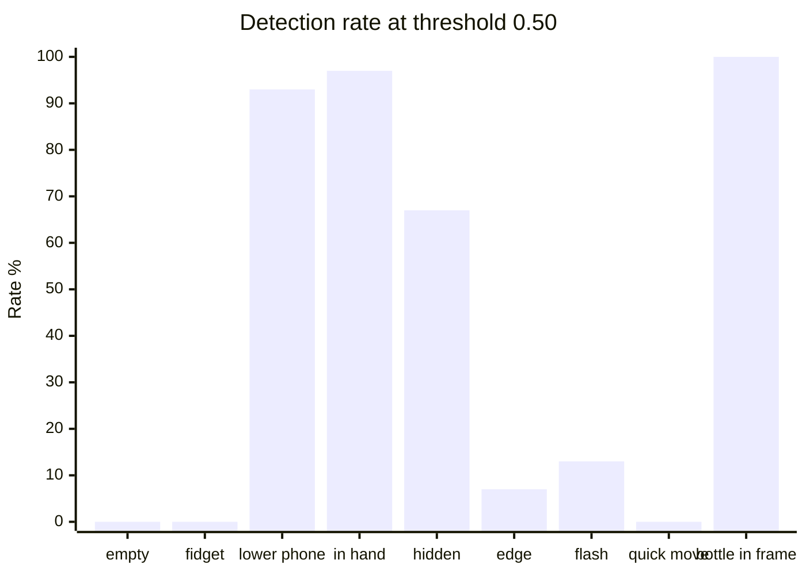

# Phone detection threshold calibration

Issue [#12](https://github.com/MarcoMll/safe-exam/issues/12). Finds a YOLO phone confidence threshold that catches phones without firing on normal exam-seat behavior.

**Recommended threshold: `0.50`**

This is also the default in [`ObjectDetectorConfig.confidence_threshold`](../../../src/safe_exam/detectors/object/config.py).

## How to run

Tooling lives in [`scripts/experiments/phone_calibration/`](../../../scripts/experiments/phone_calibration/) (durable experiment package). Findings and CSVs stay in this docs folder.

| Module | Role |
|--------|------|
| `__main__.py` | CLI entrypoint |
| `record.py` | Live capture session (camera) |
| `analyze.py` | `--summarize` (no camera) |

```bash
cd scripts
python -m experiments.phone_calibration --experiment your_experiment_name
```

| Control | Action |
|---------|--------|
| Type scenario name in the terminal | Labels the next capture |
| `SPACE` (preview window focused) | Record ~30 frames (~2.5s at 12 FPS) |
| `N` | Rename / start a new scenario |
| `Q` | Quit and print the session table |

Results append to:

```
docs/experiments/phone-calibration/results/<experiment>/phone_calibration.csv
```

Reprint stats from an existing CSV (no camera):

```bash
cd scripts
python -m experiments.phone_calibration --summarize
python -m experiments.phone_calibration --summarize path/to/phone_calibration.csv
```

### Naming scenarios

Prefix labels so summaries can split true positives from false positives:

- `phone_*` — phone is present (want detections)
- `nophone_*` — no phone (want no detections)

Examples: `phone_lower_frame`, `nophone_hand_to_face`, `nophone_empty_frame_fidgeting`.

## Experiment 1 setup

| Field | Value |
|-------|-------|
| Experiment id | `experiment_1_desktop_pc_camera` |
| Camera | Desktop PC webcam |
| Framing | Head / shoulders (desk often not fully visible) |
| Model | `yolo26s.pt` (COCO phone class `67`) |
| Capture rate | 12 FPS |
| Frames per scenario | 30 |
| Scenarios | 22 (660 frames total) |
| Raw data | [results/experiment_1_desktop_pc_camera/phone_calibration.csv](results/experiment_1_desktop_pc_camera/phone_calibration.csv) |

## Recommended threshold

**`0.50`** — aggregate non-phone false positive rate is **9.0%** (under the issue #12 &lt;10% target). Obvious phone poses stay high; the aggregate true positive rate is dragged down by hard / brief phone cases that threshold alone cannot fix.

| Threshold | False positive (`nophone_*`) | True positive (`phone_*`) |
|-----------|------------------------------|---------------------------|
| 0.25 | 14.1% | 44.8% |
| 0.35 | 11.0% | 43.3% |
| 0.45 | 10.0% | 38.1% |
| **0.50** | **9.0%** | **36.7%** |
| 0.55 | 8.5% | 34.1% |
| 0.60 | 8.2% | 27.4% |

Excluding the known bottle outlier (`nophone_dark_waterbottle_in_frame`), FP at 0.50 drops to **~1.4%**.

## Detection rate @ 0.50 (selected scenarios)



## Non-phone scenarios (false positives)

| Scenario | Mean | Max | @ 0.25 | @ 0.50 |
|----------|------|-----|--------|--------|
| `nophone_empty_frame` | 0.000 | 0.000 | 0% | 0% |
| `nophone_empty_frame_fidgeting` | 0.000 | 0.000 | 0% | 0% |
| `nophone_empty_frame_looking_around` | 0.000 | 0.000 | 0% | 0% |
| `nophone_hand_to_face` | 0.024 | 0.475 | 7% | 0% |
| `nophone_drinking_water` | 0.020 | 0.310 | 7% | 0% |
| `nophone_pen_by_face` | 0.011 | 0.342 | 3% | 0% |
| `nophone_pen_moving` | 0.000 | 0.000 | 0% | 0% |
| `nophone_notebook` | 0.027 | 0.450 | 7% | 0% |
| `nophone_headset` | 0.072 | 0.524 | 20% | 3% |
| `nophone_dark_waterbottle` | 0.160 | 0.704 | 37% | 10% |
| `nophone_dark_water_bottle_half` | 0.019 | 0.560 | 3% | 3% |
| `nophone_dark_water_bottle_drinking` | 0.000 | 0.000 | 0% | 0% |
| `nophone_dark_waterbottle_in_frame` | 0.845 | 0.906 | 100% | **100%** |

Normal exam behavior (empty frame, fidgeting, looking around, hand-to-face, pen, notebook) is clean at 0.50.

## Phone scenarios (true positives)

| Scenario | Mean | Max | @ 0.25 | @ 0.50 |
|----------|------|-----|--------|--------|
| `phone_in_hand_near_face` | 0.717 | 0.806 | 97% | **97%** |
| `phone_lower_frame` | 0.648 | 0.835 | 100% | **93%** |
| `phone_hidden_by_hand` | 0.578 | 0.840 | 100% | **67%** |
| `phone_hidden_by_hand_and_half_in_frame` | 0.242 | 0.837 | 33% | 33% |
| `phone_flashed` | 0.109 | 0.753 | 17% | 13% |
| `phone_side_ways` | 0.077 | 0.654 | 13% | 13% |
| `phone_edge_frame` | 0.061 | 0.542 | 13% | 7% |
| `phone_moved_quickly_lower_frame` | 0.073 | 0.745 | 17% | 7% |
| `phone_moved_quickly` | 0.055 | 0.459 | 13% | 0% |

## Known limitations

1. **Dark water bottle fully in frame** can score like a phone (mean confidence ~0.85). Partial / drinking poses of the same bottle are mostly fine.
2. **Brief / edge / sideways phones** are often missed. Raising or lowering the confidence threshold does not fix fleeting appearances — that needs temporal logic (e.g. flag if phone is seen in N of M frames) in Phase 1.
3. Results are from **one desktop webcam** and head/shoulders framing. Other cameras or desk-heavy crops may need their own experiment folder under `results/`.

## Adding another run

Use a new experiment name (or append to the same one if conditions are unchanged):

```bash
cd scripts
python -m experiments.phone_calibration --experiment experiment_2_laptop_webcam
```

Document notable findings in this README and commit the CSV under `results/<experiment>/`.
